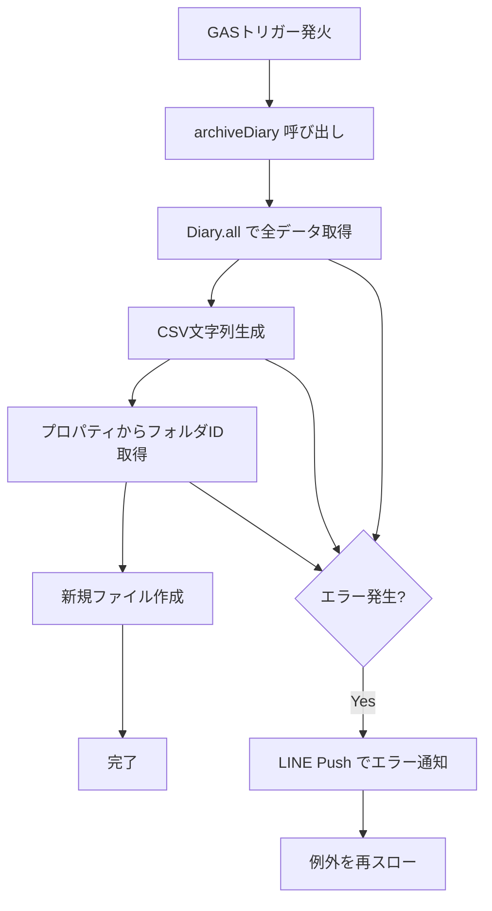

# 日記データの定期アーカイブ機能

## 概要
- 週に1回、日記データを CSV ファイルとして Google Drive に自動アーカイブする。
- データ消失リスクの軽減と、外部バックアップによる安心を目的とする。
- アーカイブ対象は、現在から過去の全日記データ。

## 仕様

### 機能要件
- 毎週日曜日 23:59 頃に、全日記データを CSV として Google Drive の指定フォルダに保存する。
- 保存先の Google Drive フォルダ ID はスクリプトプロパティ `GOOGLE_DRIVE_ARCHIVE_FOLDER_ID` で管理する。
- トリガーは GAS のトリガー機能で手動設定する（コード側でトリガー登録は行わない）。

### CSV フォーマット
| 列 | 内容 | 形式 |
| --- | --- | --- |
| A | 日付 | `yyyy/MM/dd` |
| B | 時間 | `HH:mm` |
| C | 日記内容 | テキスト |

- 文字コード: UTF-8
- ファイル名: `diary_archive_YYYYMMDD.csv` (実行日の日付)
- ヘッダー行: なし（データのみ）

### CSV エスケープ規則 (RFC 4180 準拠)
- フィールドにカンマ (`,`)、ダブルクォート (`"`)、改行が含まれる場合、フィールド全体をダブルクォートで囲む。
- フィールド内のダブルクォートは `""` にエスケープする。
- 例: `こんにちは、世界` → `"こんにちは、世界"`
- 例: `彼は"天才"だ` → `"彼は""天才""だ"`

### ファイル保存ルール
- 同名ファイルが既に存在しても削除しない（Google Drive は同名ファイルを許容するため、エラーにならない）。
- 単純に `folder.createFile()` で新規作成する。

### エラー通知
- アーカイブ処理が失敗した場合、`LINE_USER_ID` に LINE Push メッセージでエラー通知を送信する。
- メッセージ形式:
  ```javascript
  {
    type: 'text',
    text: `日記アーカイブに失敗しました: ${error.message}`
  }
  ```

### UI/メッセージ
- メニュー名: なし（自動実行のみ）
- 確認メッセージ: なし
- 完了メッセージ: なし（正常完了時は通知しない）
- エラーメッセージ: `日記アーカイブに失敗しました: {エラー詳細}`

### 制約・前提
- 既存の関連機能/コード:
  - `Diary` クラス (`src/sheet_data/bound_sheet/diary.js`)
  - `LineApiClient`, `LINE_API` (`src/apis/line_api_client.js`)
  - `LINE_USER_ID` (`src/constants.js`)
  - `BaseOperation` (`src/base_classes/base_operation.js`)
- 使用する GAS サービス:
  - `DriveApp` (Google Drive API)
  - `PropertiesService` (スクリプトプロパティ)

## 実装計画

### 使用するクラス・ファイル
| ファイル | 操作 | 概要 |
| --- | --- | --- |
| `src/sheet_data/bound_sheet/diary.js` | 修正 | `all` ゲッター追加、`getBetween` リファクタ |
| `src/operations/archive_diary_operation.js` | 新規 | アーカイブ処理の Operation |
| `src/index.js` | 修正 | `global.archiveDiary` エントリーポイント追加 |

---

### 1. Diary クラスの修正 (`src/sheet_data/bound_sheet/diary.js`)

#### 1.1 `all` ゲッターを新規作成

```javascript
/**
 * 全日記データを取得する
 * @returns {Array<{date: string, time: string, diary: string}>}
 */
static get all() {
  const sheet = this._getSheet(BOUND_SHEETS.DB);
  if (!sheet) return [];

  // ヘッダー行(2行)を除いた全データを取得
  const data = sheet.getDataRange().getValues().slice(2);

  return data.map(row => ({
    date: Utilities.formatDate(row[0], 'JST', 'yyyy/MM/dd'),
    time: String(row[1]),  // B列から時間文字列を取得
    diary: row[2],
  }));
}
```

#### 1.2 `getBetween` メソッドを `all` ゲッターを使う形にリファクタリング

```javascript
/**
 * 指定期間の日記を取得する
 * @param {string} since - 開始日 (yyyy/MM/dd形式)
 * @param {string} until - 終了日 (yyyy/MM/dd形式)
 * @returns {Object} 日付をキーに、日記の配列を値とするオブジェクト
 */
static getBetween(since, until) {
  const allData = this.all;

  const filtered = allData.filter(item => item.date >= since && item.date <= until);

  return filtered.reduce((acc, cur) => {
    const date = cur.date;
    const diaries = acc[date] || [];
    acc[date] = [cur.diary, ...diaries];
    return acc;
  }, {});
}
```

---

### 2. ArchiveDiaryOperation の新規作成 (`src/operations/archive_diary_operation.js`)

```javascript
import { BaseOperation } from 'base_classes/base_operation';
import { Diary } from 'sheet_data/bound_sheet/diary';
import { LineApiClient, LINE_API } from 'apis/line_api_client';
import { LINE_USER_ID } from 'constants';

/**
 * 日記データをCSVとしてGoogle Driveにアーカイブする
 */
export class ArchiveDiaryOperation extends BaseOperation {
  /**
   * メイン処理
   */
  _operation() {
    try {
      // 1. 全日記データを取得
      const allDiaries = Diary.all;

      // 2. CSV文字列を生成
      const csv = this._generateCsv(allDiaries);

      // 3. Google Driveにファイルを保存
      this._saveToGoogleDrive(csv);
    } catch (error) {
      // エラー時はLINEに通知
      this._notifyError(error);
      throw error;
    }
  }

  /**
   * 日記データをCSV文字列に変換する
   * @param {Array<{date: string, time: string, diary: string}>} diaries
   * @returns {string}
   */
  _generateCsv(diaries) {
    return diaries.map(d => {
      const escapedDiary = this._escapeCsvField(d.diary);
      return `${d.date},${d.time},${escapedDiary}`;
    }).join('\n');
  }

  /**
   * CSVフィールドをRFC 4180に準拠してエスケープする
   * @param {string} field
   * @returns {string}
   */
  _escapeCsvField(field) {
    if (field == null) return '';
    const str = String(field);
    // カンマ、ダブルクォート、改行を含む場合はダブルクォートで囲む
    if (str.includes(',') || str.includes('"') || str.includes('\n') || str.includes('\r')) {
      return `"${str.replace(/"/g, '""')}"`;
    }
    return str;
  }

  /**
   * CSVファイルをGoogle Driveに保存する
   * @param {string} csvContent
   */
  _saveToGoogleDrive(csvContent) {
    const folderId = PropertiesService.getScriptProperties().getProperty('GOOGLE_DRIVE_ARCHIVE_FOLDER_ID');
    if (!folderId) {
      throw new Error('GOOGLE_DRIVE_ARCHIVE_FOLDER_ID is not set');
    }

    const folder = DriveApp.getFolderById(folderId);
    const fileName = `diary_archive_${Utilities.formatDate(new Date(), 'JST', 'yyyyMMdd')}.csv`;

    // 新規ファイルを作成（同名ファイルがあっても問題なし）
    folder.createFile(fileName, csvContent, 'text/csv');
  }

  /**
   * エラーをLINEで通知する
   * @param {Error} error
   */
  _notifyError(error) {
    const client = new LineApiClient();
    const messages = [{ type: 'text', text: `日記アーカイブに失敗しました: ${error.message}` }];
    client.request(LINE_API.message.push({ to: LINE_USER_ID, messages }));
  }
}
```

---

### 3. エントリーポイントの追加 (`src/index.js`)

```javascript
import { ArchiveDiaryOperation } from 'operations/archive_diary_operation';

/**
 * 日記データをGoogle Driveにアーカイブする
 * GASトリガーから毎週日曜23:59頃に呼び出される
 */
global.archiveDiary = () => {
  new ArchiveDiaryOperation().run();
};
```

---

### 処理フロー



---

### 技術的な判断・注意点

1. **`all` ゲッターの time 取得元**
   - 現在のシートでは A列に Date 型、B列に時間文字列が格納されている。
   - `save()` メソッドを見ると `row = [[date, time, text]]` で3列を追加している。
   - よって `all` ゲッターでは `row[1]` から時間を取得すべき。

2. **プロパティの取得タイミング**
   - `GOOGLE_DRIVE_ARCHIVE_FOLDER_ID` は `constants.js` に追加せず、Operation 内で都度取得する。
   - 理由: アーカイブ機能はトリガー経由でのみ呼ばれるため、起動時にロードする必要がない。

3. **エラー通知の失敗**
   - LINE 通知自体が失敗した場合の二重エラーは考慮しない（GAS のログに残る）。

4. **データ量の上限**
   - GAS の実行時間制限 (6分) に注意。数万行程度であれば問題ない想定。

---

### GASトリガー設定手順

1. GAS エディタを開く
2. 左メニュー「トリガー」をクリック
3. 「トリガーを追加」をクリック
4. 設定:
   - 実行する関数: `archiveDiary`
   - イベントソース: 時間主導型
   - 時間ベースのトリガータイプ: 週ベースのタイマー
   - 曜日: 日曜日
   - 時刻: 23:00〜24:00

### スクリプトプロパティ設定

| キー | 値 |
| --- | --- |
| `GOOGLE_DRIVE_ARCHIVE_FOLDER_ID` | Google Drive フォルダの ID |
